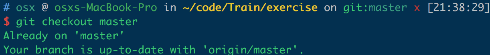
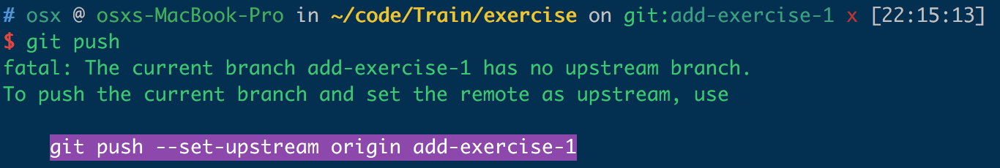
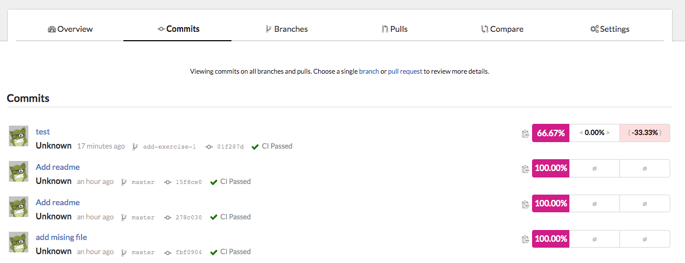
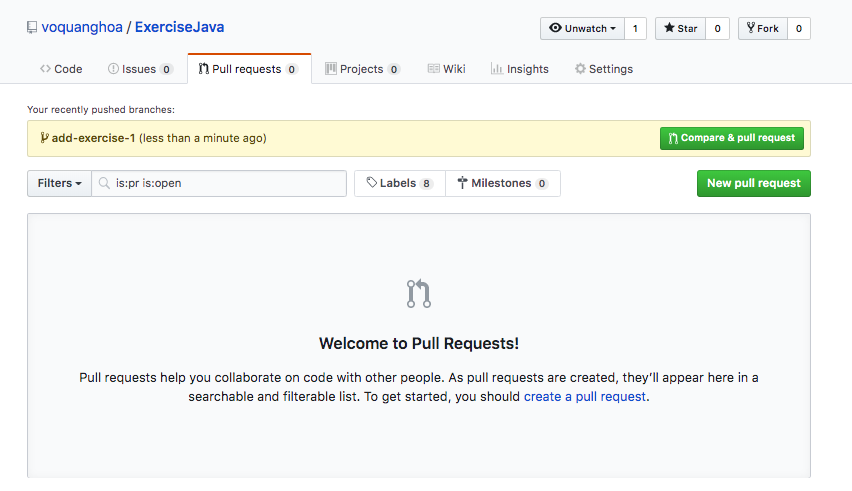

# I. Các nguyên tắc:

### 1. Về working flow

- Chỉ làm 1 bài trên 1 branch và có 1 pull request
- Chỉ open pull request nếu CircleCI xanh và CodeCov báo 100%

### 2. Về unit test

- Unit test cần đảm bảo đầy đủ các happy cases và unhappy cases
- Tên unit test class luôn có dạng `<Tên class cần test>Test`. Ví dụ cần test cho lớp `Demo` thì tên class unit test sẽ là `DemoTest`
- Tên unit test method luôn có dạng `test_<tên hàm cần hoặc thao tác>`. Ví dụ `test_get_ok`, `test_methodA`

### 3. Về code convention

- Phải follow chuẩn convention https://www.oracle.com/technetwork/java/codeconventions-150003.pdf
- Nếu không chắc chắn về một convention nào --> đặt câu hỏi, google ...

### 4. Report

- Áp dụng daily report. Các bạn phải báo cáo tiến độ công việc vào tất cả các ngày trong tuần (kể cả ngày đó bạn không lên công ty hoặc không làm gì cả)

- Báo cáo được nhắn trên Slack trước 6h tối mỗi ngày.

- Sử dụng mẫu báo cáo

```
1. Những gì đã làm được trong ngày?
    <...>
2. Những công việc bạn dự định làm ngày mai?
    <...>
3. Vấn đề bạn đang gặp phải là gì?
    <...>
4. Câu hỏi, ý kiến khác của bạn.
    <...>
```


# II. Các bước làm bài

Nếu bạn chưa setup git vào máy thì đây là link dành cho bạn [Git setup](https://github.com/voquanghoa/Git-Tutorial/blob/master/Install_on_Windows.md)

Nếu bạn chưa có repository thì vào [đây](Init.md) để xem cách tạo repository

Nếu bạn chưa rành về git thì dưới đây là một số links tham khảo

- https://backlog.com/git-tutorial/vn/
- https://www.tutorialspoint.com/git/
- https://vietjack.com/git/
- https://thachpham.com/series/git-co-ban

### 1. Về master tạo branch

Mở command line, đầu tiên hãy chắc chắn rằng mình đang ở master bằng cách chạy lệnh `git checkout master`



Để chắc ăn hơn nữa, chạy `git pull` để đảm bảo mã nguồn được cập nhật với repository

Tạo một branch mới bằng lệnh `git checkout -b <tên branch mới>`

Tên branch phải theo đúng các quy định:

- Chỉ được sử dụng các ký tự thường, chữ số và dấu gạch ngang `-` và dấu phân thư mục `/`
- Tên nhánh phải phát biểu được rõ ràng chủ đề công việc đang làm nhưng cũng đừng quá dài dòng

Ví dụ những tên sau là ổn

- `add-exercise-3`
- `use-for-instead-of-recursion`
- `fix-wrong-output-format`

### 2. Làm bài, thêm mã nguồn, test case... ect

### 3. Đẩy code lên 

Kiểm tra lại code cần đẩy lên bằng lệnh `git status` hoặc dùng source tree để xem lại sự thay đổi.

Khi đã chắc chắn những gì mình đã thay đổi, đẩy code lên bằng các lệnh

```
git add *
git commit -m <Message>
git push
```

Nếu khi chạy `git push` mà git báo lỗi như hình dưới



Chạy lại lệnh `git push` với command như được bôi hồng

### 4. Open pull request

Trước khi tiến hành tạo pull request, hãy đảm bảo code coverage đang là 100% bằng cách vào https://codecov.io và kiểm tra



Trên trang repository, vào phần `Pull Request` chọn `Compare & Pull Request` nếu nó đang hiển thị cho branch mình đang làm



Hoặc bấm `New pull request` rồi chọn branch ở bước sau

Review code lại lần nữa, thêm tiêu đề, description rồi bấm nút ..

### 5. Fix comments

Dựa vào comment, sửa lại code và đẩy lên. 

Sau đó:

- Trả lời ngắn gọn `Done`: nếu đã fix
- Câu hỏi: nếu có thắc mắc
- Thảo luận: nếu muốn cãi lộn nhiều hơn

!! Chỉ trả lời sau khi push code

### 6. Done

Task done nếu pull request được merge vào master.

# III. Khuyến khích các bạn

- Trao đổi ý tưởng, vướng mắc với nhau
- Review code lẫn nhau để
    - Học được điểm tốt từ code của người khác
    - Hạn chế lỗi mà người khác đã gặp phải
    - Tổng sỉ vả lỗi lầm người khác khi phát hiện lỗi nhằn giúp họ tiến bộ
- Trình bày vướng mắc đang có để nhanh chóng giải quyết
- Lên công ty thường xuyên (ngoài việc lên đầy đủ số buổi yêu cầu)
- Hòa đồng với nhau và với các thành viên khác trong công ty


# Good luck!!
