# Tạo repository

## 1. Đăng nhập github, chọn New repository

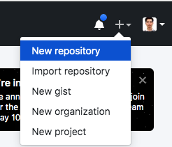

Trong phần New repository, đặt tên Repository, chọn gitignore là java

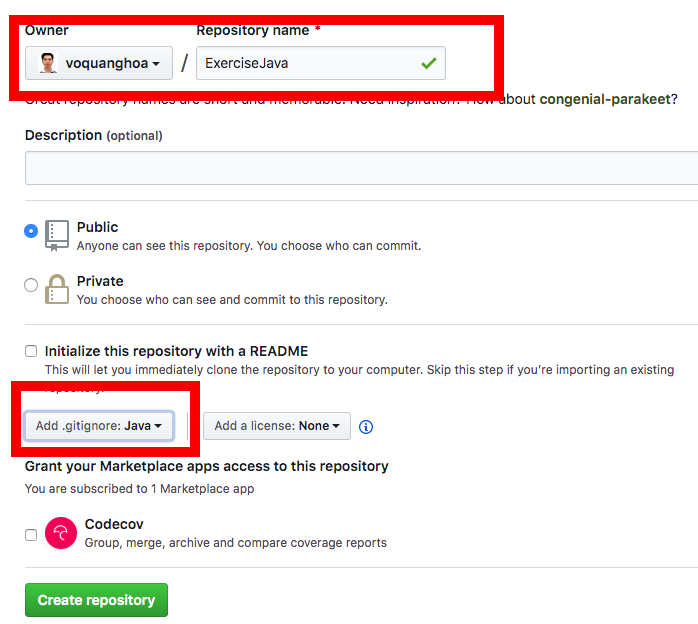

## 2. Tạo project

Mở IntelliJ chọn New Project

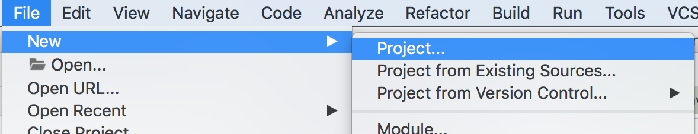

Sau đó chọn Project kiểu Gradle và tick vào phần Java Libraries

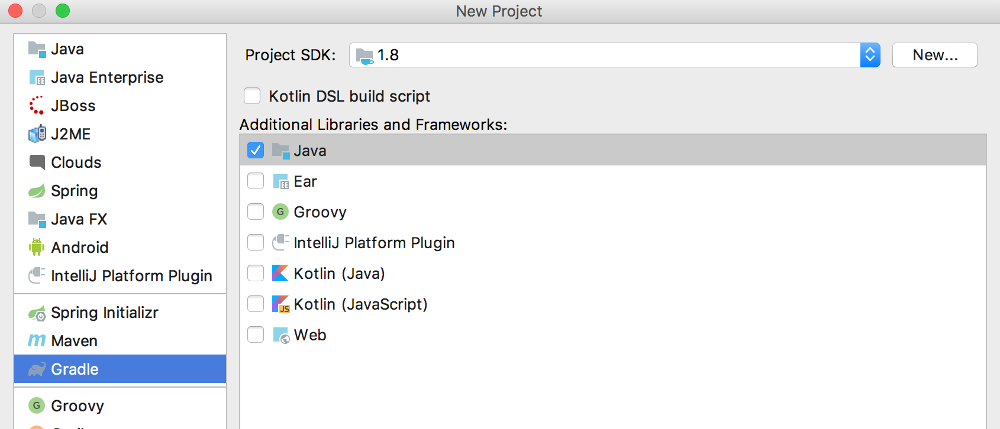

Tiếp tục điền tên ứng dụng

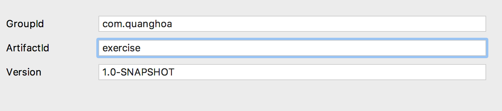

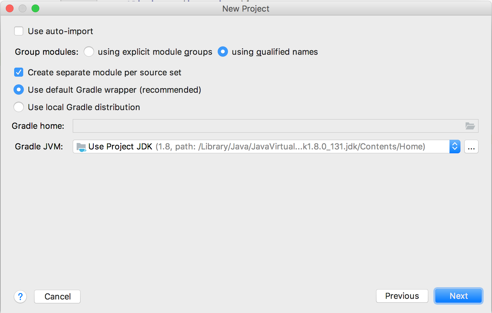

Ở bước cuối cùng, chú ý chọn thư mục lưu trữ dự án vào nơi thích hợp rồi bấm Finish

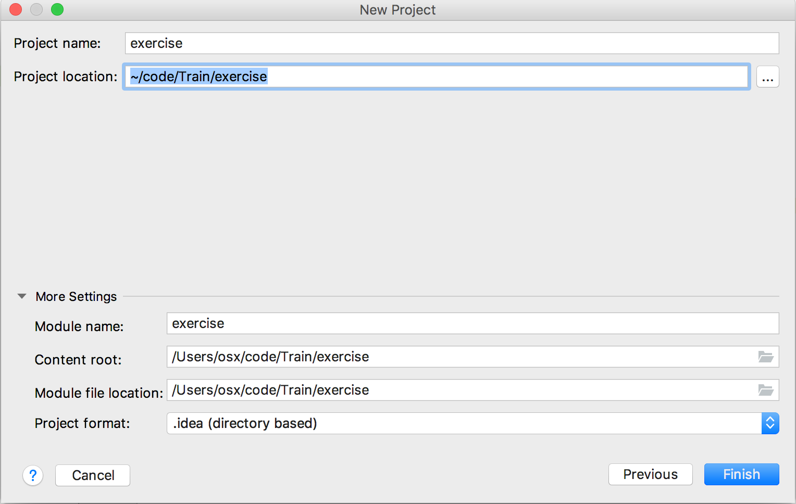

## 3. Add sample code

Sau khi dự án được tạo, đợi một lúc để IDE đồng bộ cấu hình gradle từ template, ta sẽ được

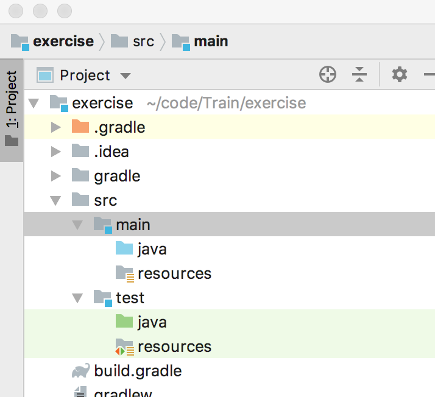

Mở file build.gradle và cập nhật phần cuối file

```gradle
dependencies {
    testImplementation("org.junit.jupiter:junit-jupiter-api:5.7.2")
    testRuntimeOnly("org.junit.jupiter:junit-jupiter-engine:5.7.2")
}

test {
    useJUnitPlatform()
}
```

Bấm vào biểu tượng như dưới để cập nhật


Tham khảo [Configuring Test Engines](https://junit.org/junit5/docs/current/user-guide/#running-tests-build-gradle-engines-configure)


Ta thêm class `Demo` vào gói main/java

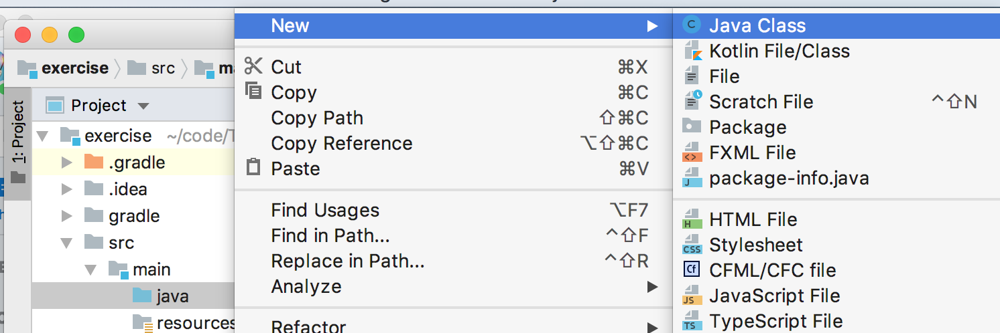

Với nội dung


```java
public class Demo {
    public int sum(int x, int y){
        return x+y;
    }

    public int sub(int x, int y){
        return x-y;
    }

    public int multiple(int x, int y){
        return x*y;
    }
}
```

Thêm class `DemoTest` vào gói test/java với nội dung

```java
import org.junit.jupiter.api.Test;

import static org.junit.jupiter.api.Assertions.assertEquals;

public class DemoTest {

    @Test
    public void test_sum(){
        assertEquals(new Demo().sum(2, 8), 10);
    }

    @Test
    public void test_sub(){
        assertEquals(new Demo().sub(8, 3), 5);
    }

    @Test
    public void test_multiple(){
        assertEquals(new Demo().multiple(8, 3), 24);
    }
}
```

Chạy test

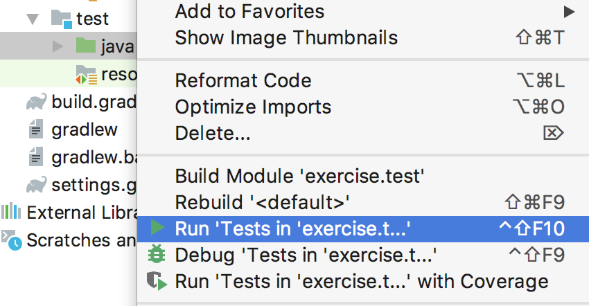


Nếu kết quả nhận được toàn màu xanh là done

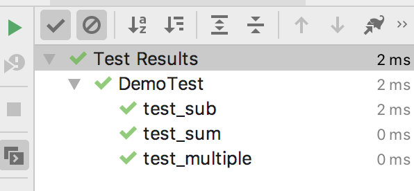

Tham khảo [Writing Tests](https://junit.org/junit5/docs/current/user-guide/#writing-tests)

## 4. Cấu hình CircleCI và Codecov

Mở file build.gradle

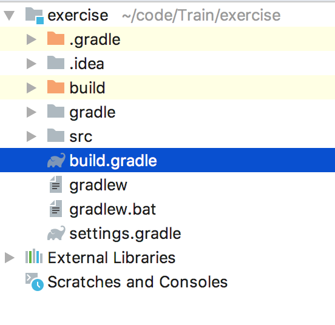

Thay 

```
plugins {
    id 'java'
}
```

ở đầu file thành

```
apply plugin: 'java'
apply plugin: 'jacoco'
```

Thêm đoạn này vào cuối file

```
jacocoTestReport {
    reports {
        xml.enabled true
        html.enabled false
    }
}

check.dependsOn jacocoTestReport
```

Tạo một thư mục tên là .circleci và sau đó tạo 1 file tên là `config.yml` 

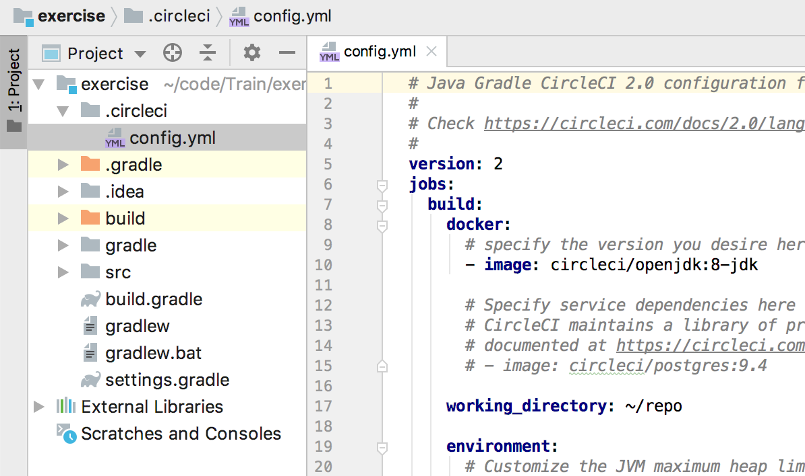

với nội dung

```yml
# Java Gradle CircleCI 2.0 configuration file
#
# Check https://circleci.com/docs/2.0/language-java/ for more details
#
version: 2
jobs:
  build:
    docker:
      # specify the version you desire here
      - image: circleci/openjdk:8-jdk

      # Specify service dependencies here if necessary
      # CircleCI maintains a library of pre-built images
      # documented at https://circleci.com/docs/2.0/circleci-images/
      # - image: circleci/postgres:9.4

    working_directory: ~/repo

    environment:
      # Customize the JVM maximum heap limit
      JVM_OPTS: -Xmx3200m
      TERM: dumb

    steps:
      - checkout

      # Download and cache dependencies
      - restore_cache:
          keys:
            - v1-dependencies-{{ checksum "build.gradle" }}
            # fallback to using the latest cache if no exact match is found
            - v1-dependencies-

      - run: gradle dependencies

      - save_cache:
          paths:
            - ~/.gradle
          key: v1-dependencies-{{ checksum "build.gradle" }}

      # run tests!
      - run:
          name: Running test
          command: gradle test

      # Upload test coverage
      - run:
          name: Generate test coverage
          command: gradle jacocoTestReport

      # Upload test coverage
      - run:
          name: Upload test coverage
          command: bash <(curl -s https://codecov.io/bash) || echo "Codecov did not collect coverage reports"

```

## 5. Đồng bộ project với github repository

Mở command line tại thư mục gốc của dự án và gõ `git init`


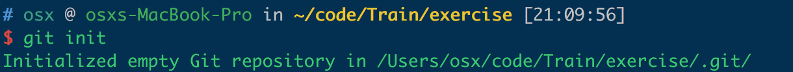

Copy url của repository như hình 

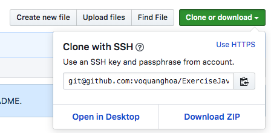

Rồi chạy lệnh `git remote add origin <url vừa copy>`

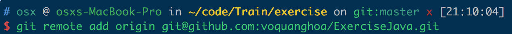

Tiếp tục chạy `git pull` để lấy code về

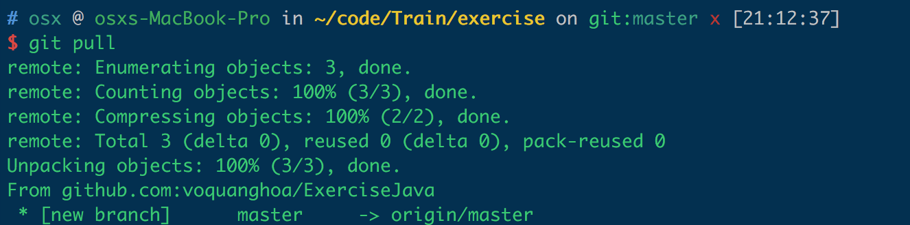

Mở file `.gitignore`

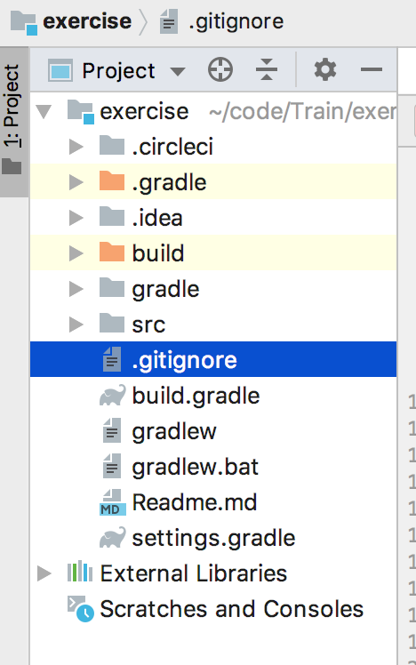

Thêm các dòng này vào cuối file

```
build/**
.gradle/**
.idea/**
out/**
```

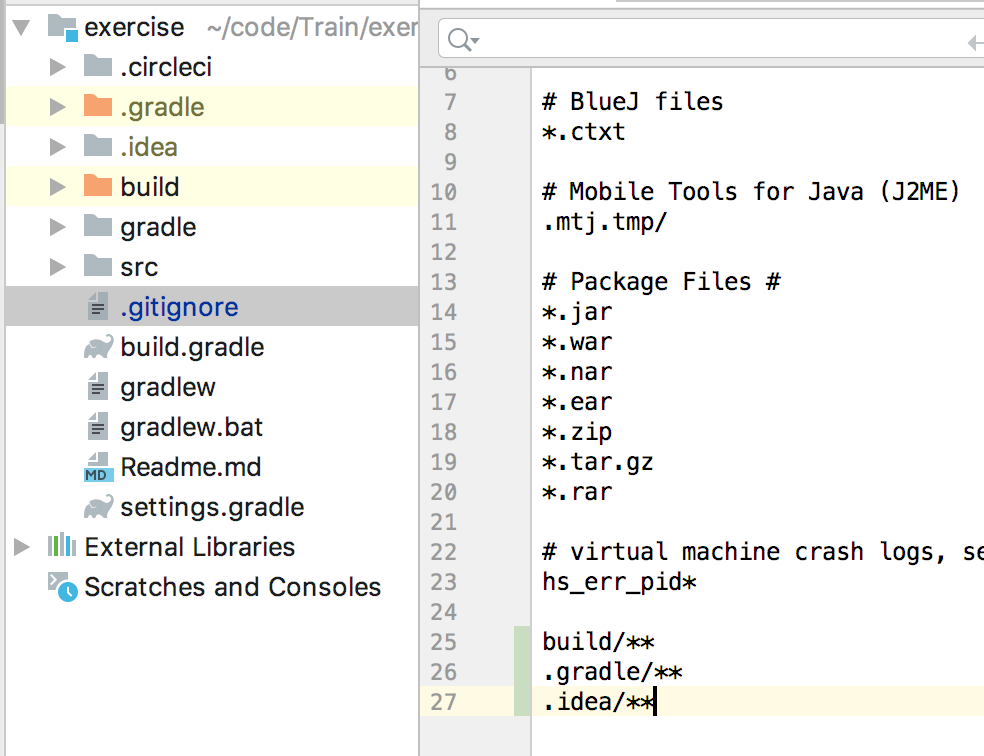

Sau đó đẩy code lên

```
git add .circleci/config.yml
git add *
git commit -m Init
git push --set-upstream origin master
```

Quay lại repository, reload lại trang, ta sẽ thấy code đã được đẩy lên

## 6. Build code bằng circleCI

Đăng nhập circle ci, chọn phần Add projects

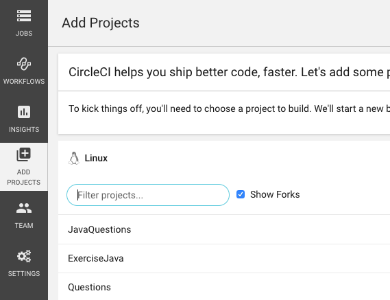

Tìm repository và bấm Set up Project. Sau đó chọn kiểu dự án là Gradle trên Linux

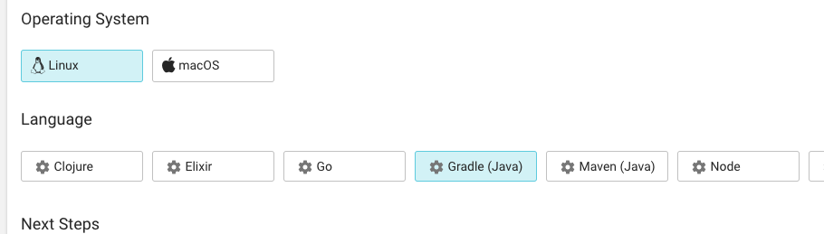

Sau đó bấm build Project (Nhớ thắp hương trước khi bấm)

Nếu bạn gặp may, nó sẽ xanh như thế này

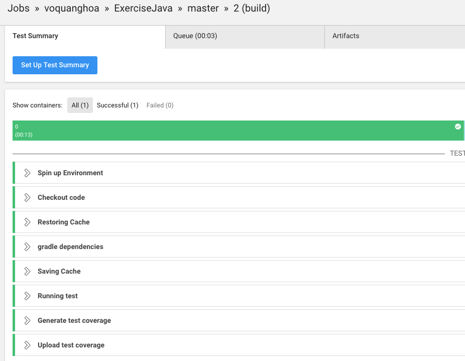

Sau đó tìm chổ Project setting, copy mã Embed Code vào đâu đó, ở bước cuối ta sẽ tạo file Readme.md

## 7. Cấu hình Codecov

Vào trang https://codecov.io, đăng nhập bằng tài khoản github sau đó chọn repository hiện ra. 

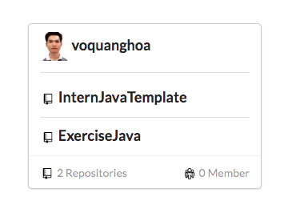

Sau đó vào setting chọn Badge và copy phần mã Markdown

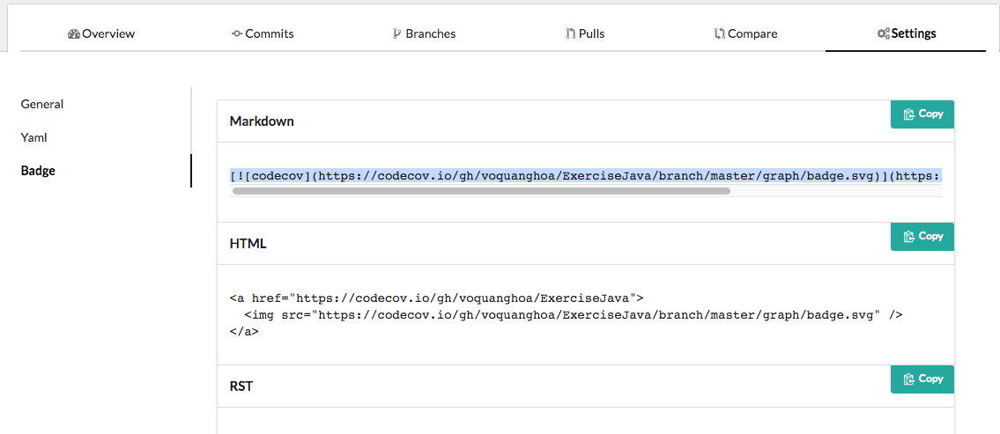

## 8. Tạo file Readme.md

Ở thư mục gốc của dự án, ta tạo file `Readme.md` với nội dung (Chú ý tên file có extension là md, không phải txt)

```
# Java exercise

- Build status <Code từ CircleCI>
- Test coverage <Code từ CodeCov>
```

Nhớ thay phần code place holder bằng code tương ứng ở bước trước

Đầy file này lên

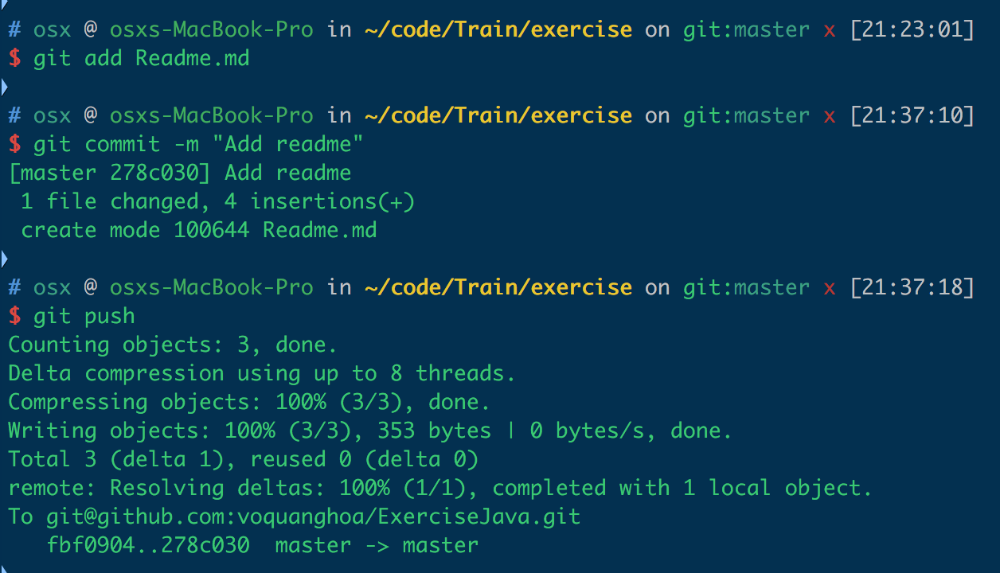

Tận hưởng thành quả

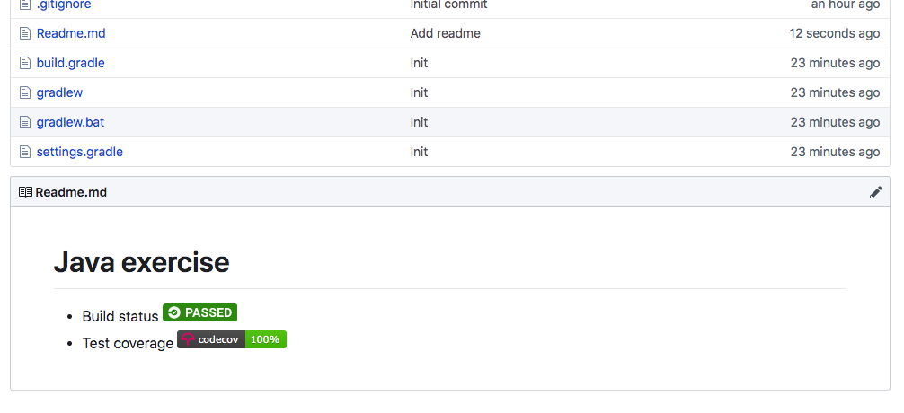

-------

# Done!!

